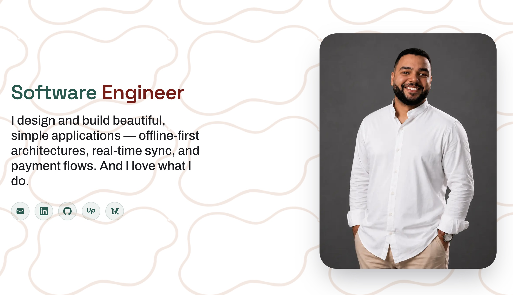

<!-- Animated Header Banner -->

  

<!-- Typing SVG -->

  

<h3 align="left">
  Welcome to Adel Mostafa's github!
  
</h3>

- **Flutter Developer | Mobile Software Engineer** with 4+ years of hands-on experience
- Building cross-platform iOS & Android apps for clients across **Egypt, UAE, Saudi Arabia, and the USA**
- **Top Rated Flutter Developer on Upwork** with a proven track record in healthcare, fintech, F&B, and government sectors
- Specializes in **real-time data architectures**, **offline-first solutions**, and **scalable mobile UIs**
- Ask me about **Flutter, Dart, BLoC, Supabase, Offline-First Architecture**, or anything mobile!

---

### Connect with Me

  
  

---

  

### &nbsp;Tech Stack

**Mobile Development**

&nbsp;
&nbsp;

**State Management & Architecture**

&nbsp;
&nbsp;
&nbsp;

**Backend & Databases**

&nbsp;
&nbsp;
&nbsp;
&nbsp;
&nbsp;

**DevOps & CI/CD**

&nbsp;
&nbsp;
&nbsp;
&nbsp;
&nbsp;

**AI & Automation**

&nbsp;
&nbsp;

**Payments & Integrations**

&nbsp;

### Education & Certifications

-  **B.Sc. Computing and Data Science** — Alexandria University *(2021 – 2025)*
-  **CCNA Network Certificate** — Cisco / NTI *(2023)*

---

###  Languages

-  Arabic — Native
-  English — Fluent

---

<!-- Animated Footer Banner -->

  

